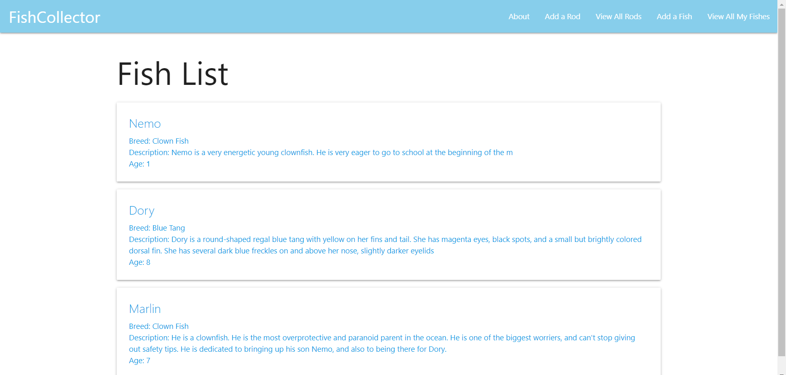
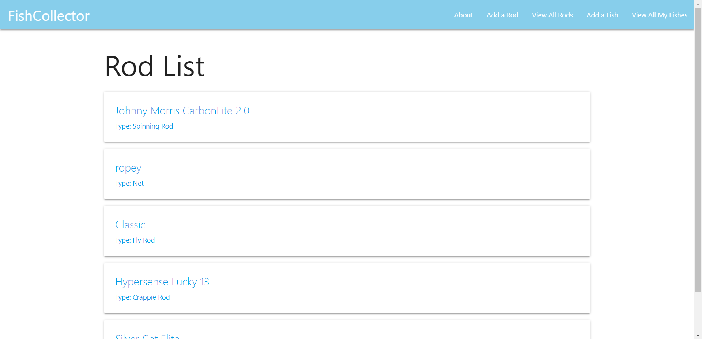
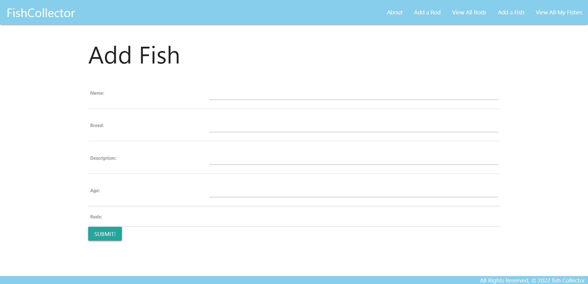
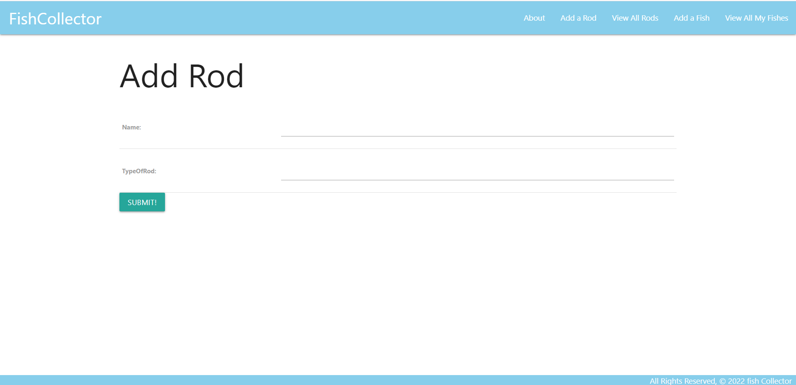
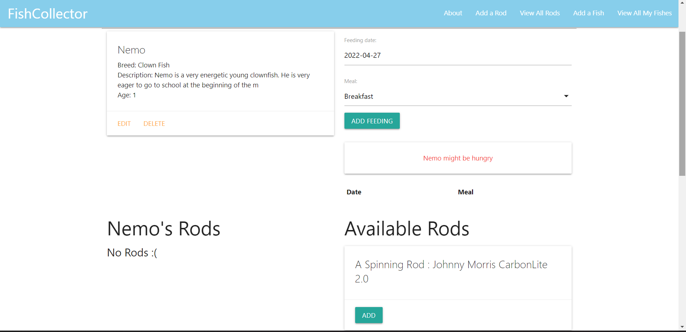
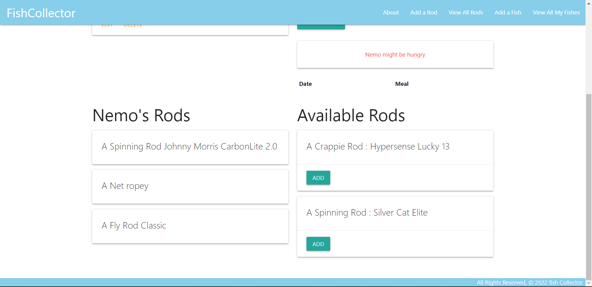

# Fish Collector App
Application created using Django, a Python-based web framework. This application has full CRUD functionality. A user can add, edit, delete and see all of the created fish and rods.

### Screenshots:
All Fishes:

All Rods:

Add Fish:

Add Rod:

Details page:

Adding rods to Fishes:

### Technologies Used:
* Python3: Helps with Rapid Application Development.
* Django: Django is a Python-based free and open-source web framework that follows the model–template–views architectural pattern. Set-up the skeleton.
* Materialize: Used for the css in the application.
### Next Steps:
* As a user I want to be able to delete the rods from the fishes.
* As a user I want to be able to Add a fish to a certain terrain.
* As a user I want to be able to add a picture of my fish.